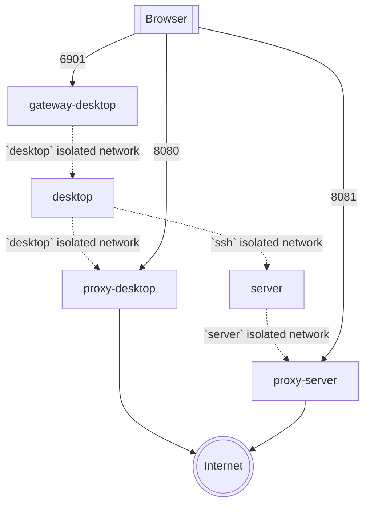

# Visual Studio Code traffic analyzer

## Description

This repo is a collection of containers that allows you to analyze the traffic generated by Visual Studio Code and its remote server. It does so by running both the desktop and the server versions in isolated containers whose only traffic can go through [mitmproxy](https://mitmproxy.org).



## Usage

Use [Docker Compose](https://docs.docker.com/compose/) as follows:

```
docker compose up
```

The following ports will be exposed:
| port | service | url |
| ---- | ------- | --- |
| 8080 | mitmproxy desktop traffic | http://localhost:8080/ |
| 8081 | mitmproxy server traffic | http://localhost:8081/ |
| 6901 | remote desktop (via [Kasm](https://kasmweb.com)) | https://localhost:6901/ |

Remote desktop credentials are `vscode`/`password`. The password can be configured through the `VNC_PW` environment variable in the `desktop` service. The TLS/SSL certificate is currently just a self-signed one that is generated during the first run.

The desktop environment already has the `server` host available through SSH, and it will show up automatically in the VSCode remote extension. The VSCode server binaries are already installed on the server to get you started quickly.

You can stop all the containers with `docker compose stop`. To destroy them, use `docker compose down`. To remove absolutely everything, including the volumes, use `docker compose down -v`.
